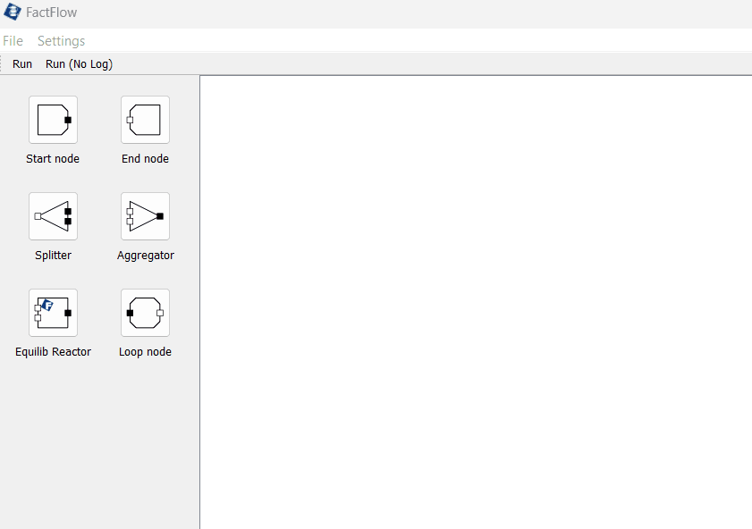
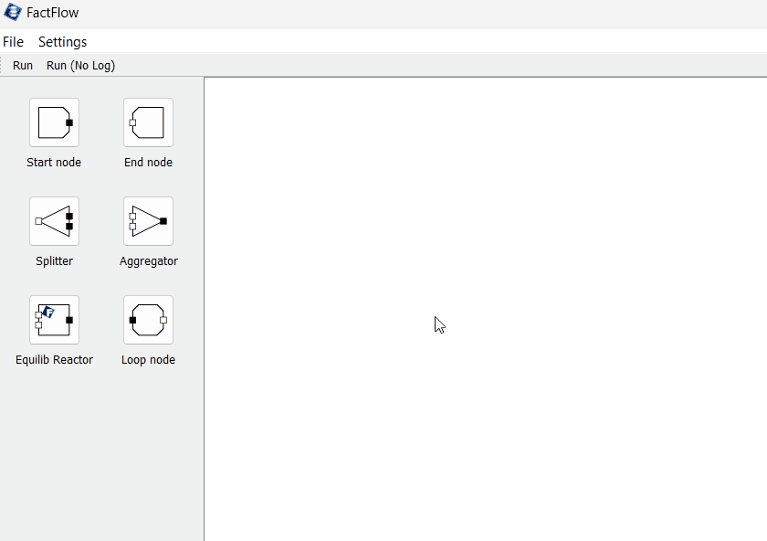
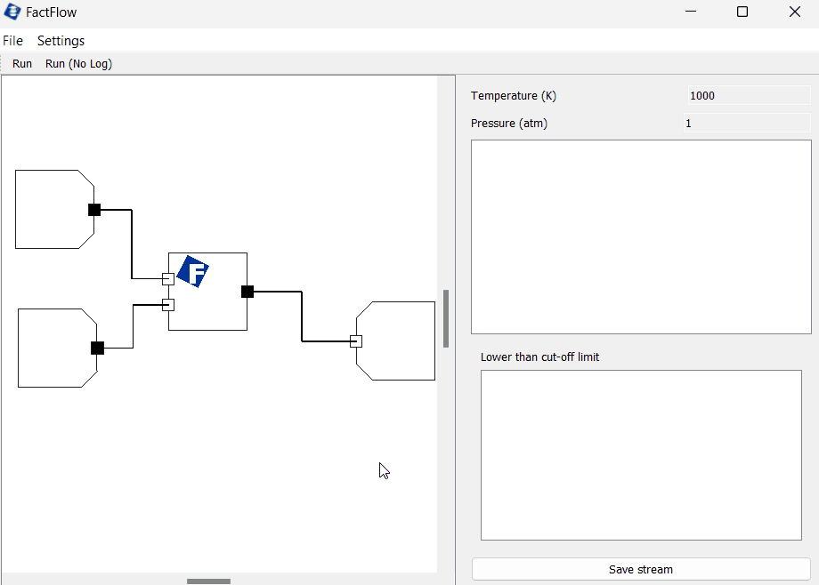
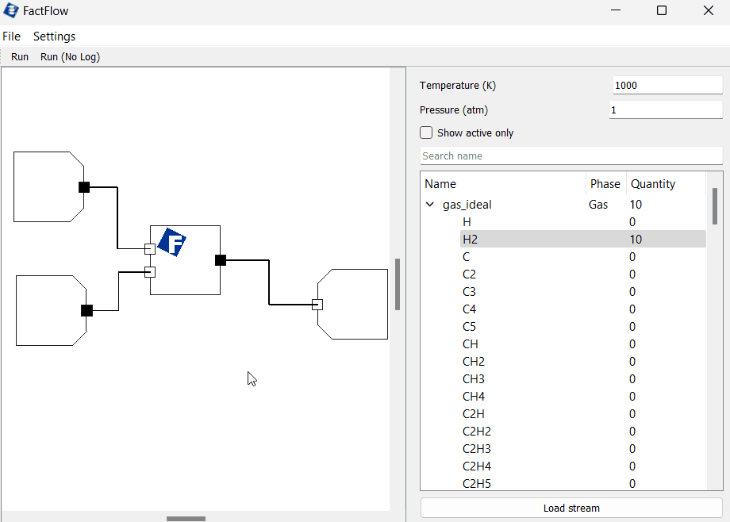
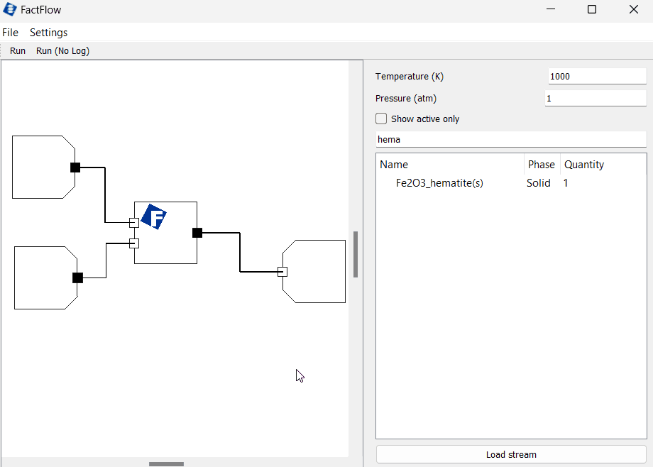
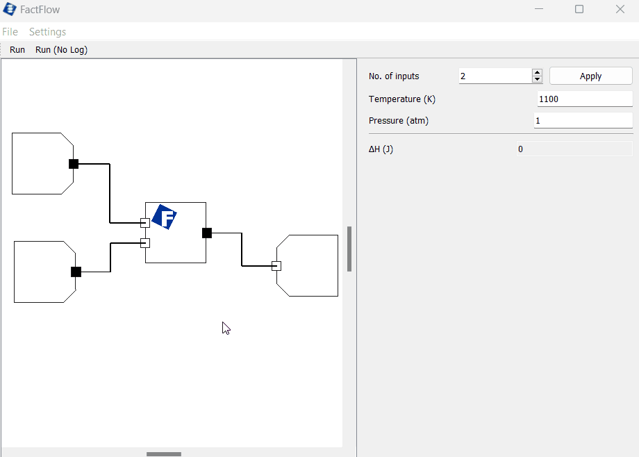

Getting Started
=====

Loading a CST file
------------

In order to perform equilibrium calculations, you must import a CST file into FactFlow. FactFlow will use this database to obtain information for phases and phase constituants that will appear in your process.

After generating your CST file from FactSage, you can import it in a FactFlow flowsheet by clicking on the "Load CST" button under "File".

Assembling the flowsheet
----------------

FactFlow works by assembling Nodes on the flowsheet, and linking them together. Details about each individual node are explained in the :doc:`nodes` section of the documentation.

In this example, we perform a very simple hematite reduction process using 2 Start Nodes, 1 Equilib Reactor node, and 1 End Node.

Entering reactants
----------------

After assembling the flowsheet, we must now enter quantities for each reactant.
For our hematite reduction example, hydrogen and hematite are entered as reactants into the Start Nodes.

Setting equilibrium conditions
----------------

Next, equilibrium conditions are entered. Temperature, pressure, and enthalpy are the different options.
For our example, we will be setting the equilibrium temperature to 1100K.

Calculate
----------------

Now that we have our flowsheet, all that is left is performing the equilibrium calculation, and displaying the results.
Click on the "Run" button to solve the flowsheet, and view the results by clicking on the End Node.

