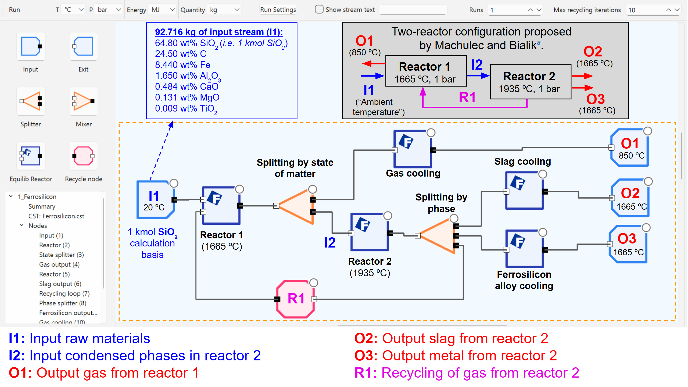

Welcome to the FactFlow documentation
===================================

**FactFlow** is FactSage's **process simulation and optimization** tool. It is directed to users who are very familiar with **Equilib** and who wish to perform a large series of equilibrium calculations that are connected via streams. FactFlow **simplifies the use of streams and equilibrium reactors** via an easy-to-use graphical interface or **flowsheet**. 

To get started with **FactFlow**, refer to our `User Manual <https://factsage.com/factflow/docs/FactFlow_Manual.pdf>`_ for an overview of its features and functionality. For examples demonstrating the application of FactFlow in various pyrometallurgical processes, see this paper: `Pyrometallurgical process modeling using FactFlow <https://doi.org/10.1016/j.calphad.2024.102772>`_.

   Ferrosilicon production via an electrical arc furnace, implemented in FactFlow.
