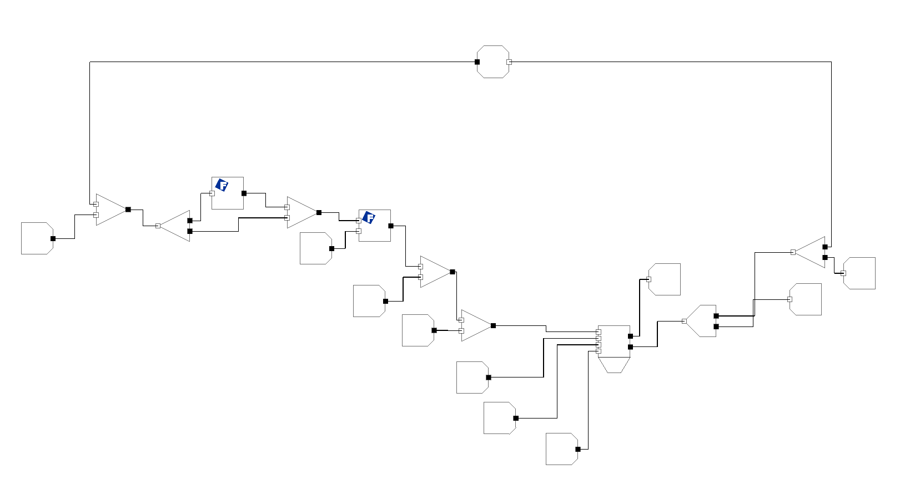

Welcome to FactFlow's documentation!
===================================

**FactFlow** is a process simulation software that uses FactSage calculations to perform equilibrium calculations.

Check out the :doc:`getting-started` section for a quick start guide, :doc:`nodes` for more detailed explanations on what each Node does, and :ref:`analysis` for a guide on how to calculate equilibrium over a range of values.

.. note::

   The documentation for this project is under active development.

Contents
--------

.. toctree::

   getting-started
   nodes
   analysis
