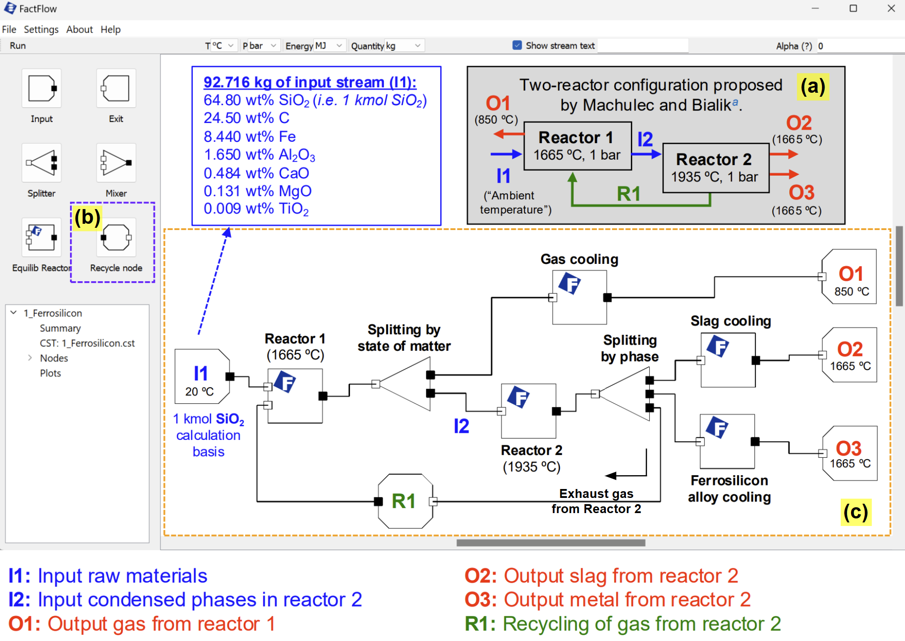

Welcome to the FactFlow documentation
===================================

**FactFlow** is a process simulation program that is an **Add-on** to the **FactSage** thermochemical software and database package. It is directed to users who are very familiar with **Equilib** and who wish to perform a large series of equilibrium calculations that are connected via streams. **FactFlow** is primarily developed to **simplify the use of streams and equilibrium reactors** via an easy-to-use graphical interface or **flowsheet**. 

**FactFlow** accesses the **FactSage** databases (.cst files) and the user defines the initial conditions including compositions and amounts of the individual streams. When calculating, **FactFlow** employs the same chemical equilibrium calculation algorithms as in **Equilib**.

   Ferrosilicon production via an electrical arc furnace, implemented in FactFlow.

To get started with **FactFlow**, refer to our `Quick Start Guide <https://www.factsage.com/Factflow/Docs/FactFlow%20Quick%20Start%20Guide%20V1.1.pdf>`_ for an overview of its features and functionality. For examples demonstrating the application of FactFlow in various pyrometallurgical processes, see this paper: `The power of computational thermochemistry in high-temperature process design and optimization: Part 2 – Pyrometallurgical process modeling using FactFlow <https://doi.org/10.1016/j.calphad.2024.102772>`_.

.. note::

   The documentation for this project is under active development.
