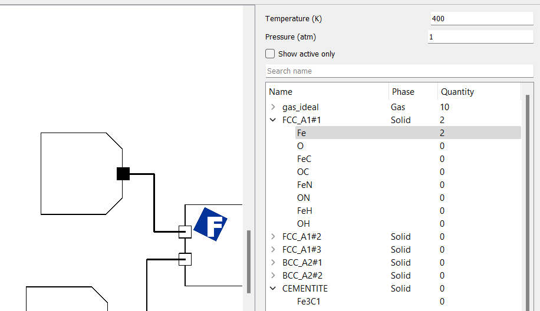
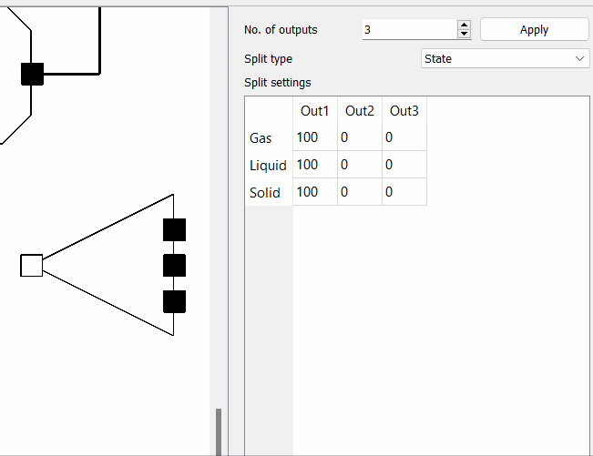
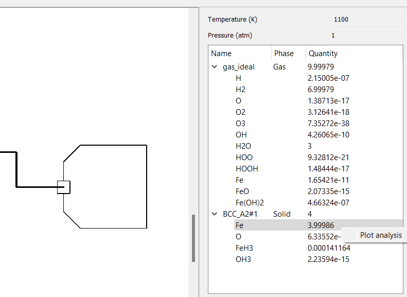
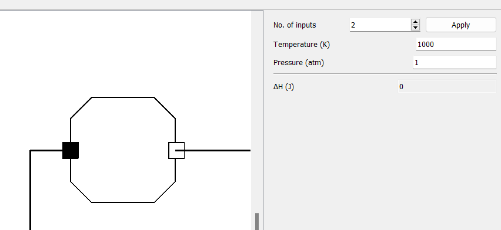

Nodes
=====

Start Node
------------

Start Nodes are used to enter the reactant quantities for a process.
The inspector interface features a Stream View and input fields for the temperature and pressure of the input Stream.
A search bar can be used to filter phases and phase constituants in the Stream View, and the "Show active only" checkbox filters so that only reactants with a defined quantity are displayed.

Equilib Reactor
------------

The Equilib Reactor takes in an arbitrary number of input Streams and outputs a single Stream.
It essentially simulates the FactSage Equilib module in a FactFlow node.
Temperature, pressure and enthalpy input fields allow the user to define equilibrium conditions.

.. image:: EquilibReactor.png
   :alt: EquilibReactor
   :align: center

Splitter
------------

The Splitter takes in a single input Stream and produces an arbitrary number of output Streams.
There are 3 Split modes: Phase, State, and Flow. These different modes allow the user to define a mass percentage for each output Stream for each phase, each state, and total quantity, respectively.

End Node
------------

The End Node allows the user to view the products from their simulation via a Stream View.
Right-clicking on a phase or a phase constituant displays the option to plot results in a graph, if the flowsheet contains a range.

Loop Node
------------

The Loop node allows the user to create a recycling loop in their simulation.
Unlike other nodes, the input slot is on the right, and the output slot is on the left.
The threshold value corresponds to the percentage error that must be attained for the Loop node to consider that the looping has converged.
If the looping has not converged after maximum iterations, the loop will stop.

